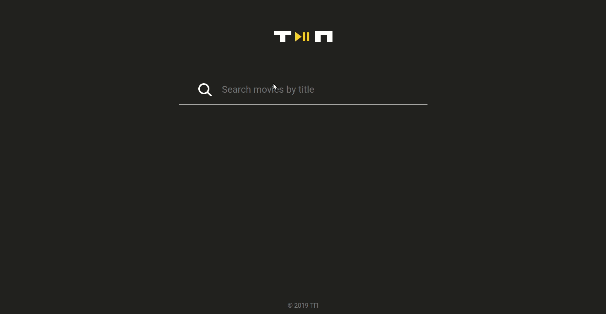

# Search-o-matic

Search for movies by title.
Tag list, search result and search input are saved in a local storage.

Succesfull results are joining the tag list.
Use |Enter| for the faster search.
Use |Alt| + |Click| for removing a tag.

##English:
**There are 4 states (only one of them is showing)**
- Input is not active
- Results of a search
- No results found
- The page is scrolled down

**The following components are implemented:**
- Header
- Input
- Results
- Footer

**Input component has 3 states:**
- Default
- In focus 
- Full width

**Results component has 3 states:**
- The search has not been performed
- Smth found
- Not found

##Русский:

**Реализовано 4 состояния (единовременно отображается лишь одно из них):**
- Поиск ещё не выполнялся
- Поиск с результатами
- Поиск без результатов
- Страница проскроллена вниз

**На странице реализованы блоки:**
  - "заголовок"
  - "строка поиска"
  - "результаты поиска"
  - "подвал"

**У блока "строка поиска" 3 состояния:**
  - "обычное не в фокусе"
  - "обычное в фокусе"
  - "на всю ширину экрана"

**У блока "результаты поиска" 3 состояния:**
  - "поиск ещё не выполнялся"
  - "есть результаты"
  - "ничего не найдено"

- У блока "строка поиска" есть набор тегов, который не помещается по ширине и перенос тегов на следующую строку происходит согласно макету
- При наведении курсора на крестик в строке поиска он подсвечивается
- В списке фильмов есть "плитки" во всех возможных состояниях: "загрузка", "есть текст, нет постера", "есть постер"
